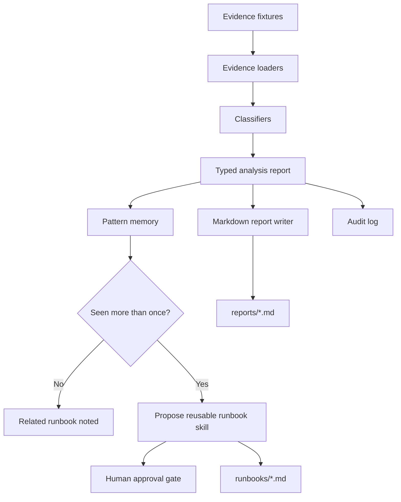

# Runbook Forge

Self-improving CloudOps agent for incident triage and reusable SRE procedures.

Runbook Forge is a production-minded portfolio project for Cloud Engineering, DevOps, and SRE roles. It ingests local evidence from CI/CD, Terraform plan JSON, AWS-shaped fixture signals, logs, and repository context. It generates structured triage reports, risk-ranked next steps, and reusable runbook skill drafts when a failure pattern repeats.

It is recommend-only by default. It does not auto-remediate real AWS resources.

## Project pitch

Incident response often loses the same knowledge repeatedly: a failed ECS deployment, a risky Terraform plan, a Lambda consumer backlog, a rollout that needs the same checks every time. Runbook Forge turns those repeated patterns into procedural memory.

The CLI analyzes evidence, writes Markdown reports, tracks deterministic incident fingerprints in `.runbook_forge/patterns.json`, and proposes reusable runbook skills after recurrence. A Hermes-style workflow can call the CLI, read reports, and promote repeated patterns into reusable procedures.

## Why this is not just another chatbot

- Typed incident models rather than free-form chat state.
- Deterministic fingerprints for recurring failure patterns.
- Local audit log for report and runbook generation.
- Human approval gates on every infrastructure-changing action.
- Fixture-driven demos and tests that require no AWS credentials.
- Hermes integration folder with portable skill definitions and adaptation notes.

## Architecture



## Supported analysis modes

### Terraform plan risk review

Detects:

- Public S3 bucket exposure.
- Security group ingress from `0.0.0.0/0` or `::/0`.
- IAM wildcard actions or resources.
- RDS replacement or destructive changes.
- Cost signals such as NAT Gateway creation.

### ECS deployment failure triage

Reads fake GitHub Actions, ECS service events, target group health, stopped task data, and container logs. Detects likely causes such as health check failure, image tag mismatch, task role permission issue, container crash, or insufficient capacity.

### SQS/Lambda backlog triage

Reads fake queue depth, oldest message age, DLQ count, Lambda errors, throttles, timeouts, duration, concurrency, and logs. Detects throttling, timeout pressure, poison messages, batch/concurrency mismatch, and downstream failures.

## Quick start

```bash
python -m venv .venv
source .venv/bin/activate
pip install -e ".[dev]"
pytest
runbook-forge demo
```

The demo writes:

- `reports/terraform-review.md`
- `reports/ecs-triage.md`
- `reports/sqs-lambda-triage.md`
- `runbooks/ecs_deploy_failure_triage.md`
- `.runbook_forge/patterns.json`
- `.runbook_forge/audit.log`

The demo intentionally replays the ECS fixture once so recurrence detection proposes a reusable ECS runbook skill.

## Individual commands

```bash
runbook-forge analyze terraform-plan \
  --input fixtures/terraform/plan_public_s3.json \
  --output reports/terraform-review.md

runbook-forge analyze ecs-deploy \
  --input fixtures/aws/ecs_failed_deploy.json \
  --output reports/ecs-triage.md

runbook-forge analyze sqs-lambda \
  --input fixtures/aws/sqs_lambda_backlog.json \
  --output reports/sqs-lambda-triage.md

runbook-forge propose-skill \
  --from-report reports/ecs-triage.md \
  --output runbooks/ecs_deploy_failure_triage.md
```

## Example report output

```markdown
# Runbook Forge Report: ecs-deploy

## Executive summary
ECS deployment for checkout-api is not stable. Most likely cause: health check failure.

## Severity
high

## Human approval required before write actions
Yes. The following actions are recommend-only and must be manually approved: Execute rollback only after approval
```

## Safety model

Runbook Forge is designed to recommend, not mutate.

- No demo command requires AWS credentials.
- Tests do not make network calls.
- Boto3 adapters are optional and read-only.
- Write commands are rendered as proposed text.
- `ApprovalGate` marks actions as `read_only`, `propose_only`, or `requires_human_approval`.
- Secret redaction covers AWS keys, GitHub tokens, private keys, passwords, generic tokens, API keys, and connection strings.
- `.runbook_forge/audit.log` records local report and skill generation events.

Do not execute generated write commands without a separate human approval workflow.

## Hermes integration

This repo does not assume undocumented Hermes APIs. The `integrations/hermes/` folder explains an adapter pattern:

- Hermes calls the CLI.
- Hermes reads generated Markdown reports.
- Hermes uses `.runbook_forge/patterns.json` for procedural memory.
- Hermes promotes repeated fingerprints into reusable Markdown skills.
- Hermes never executes write actions without human approval.

Included Hermes-style skills:

- `integrations/hermes/skills/terraform_plan_review.md`
- `integrations/hermes/skills/ecs_deploy_failure_triage.md`
- `integrations/hermes/skills/sqs_lambda_backlog_triage.md`

## Screenshots placeholder

Add screenshots after running the demo locally:

- Terminal output from `runbook-forge demo`.
- Generated Terraform review report.
- Generated ECS triage report with recurrence metadata.
- Generated runbook skill draft.

## What this demonstrates for DevOps roles

- Cloud incident triage using structured evidence.
- Terraform plan review for security, data, and cost risk.
- ECS deployment debugging workflow.
- SQS/Lambda backlog diagnosis.
- Safe operational automation with human approval boundaries.
- Testable CLI design with typed models and fixture-backed evidence.
- Procedural memory that turns repeated incidents into reusable procedures.

## Resume bullets

- Built a Python CloudOps CLI that classifies Terraform, ECS, and SQS/Lambda incidents from structured evidence and generates SRE-grade Markdown triage reports.
- Implemented deterministic incident fingerprinting and local pattern memory to recommend reusable runbook skills when failure modes recur.
- Designed a recommend-only safety model with secret redaction, audit logging, and explicit approval gates for all infrastructure-changing actions.
- Added pytest coverage, ruff linting, mypy configuration, and GitHub Actions CI for a production-quality portfolio workflow.

## Future improvements

- Add real read-only AWS collection commands behind explicit configuration.
- Add GitHub issue or pull request draft generation.
- Add policy-as-code export for Terraform findings.
- Add richer repository documentation retrieval.
- Add report snapshots or dashboard rendering for incident trends.

## Assumptions

- Hermes can invoke local CLI tools and read Markdown outputs, but no undocumented Hermes API is assumed.
- Real AWS writes are out of scope by design.
- Fixtures use fake account ID `123456789012` and synthetic service data.
